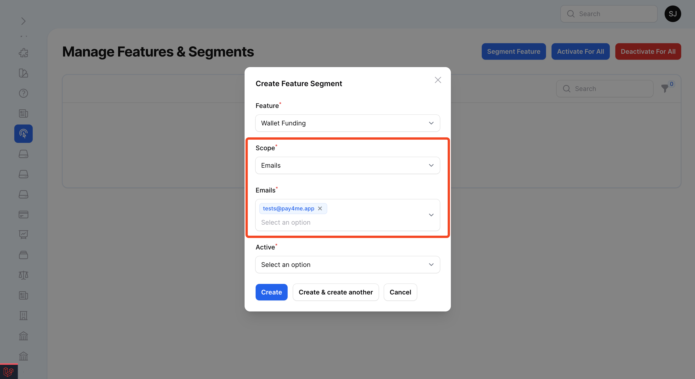
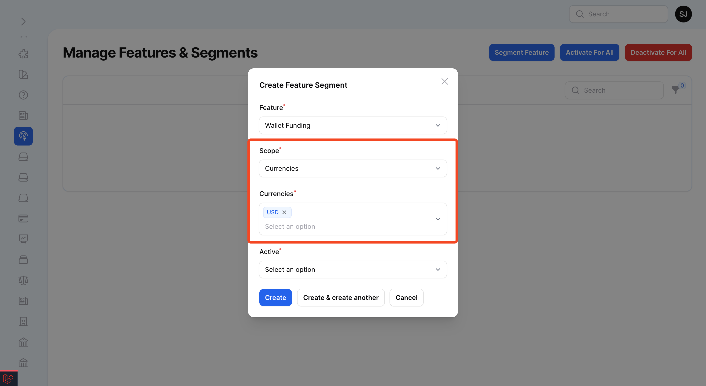
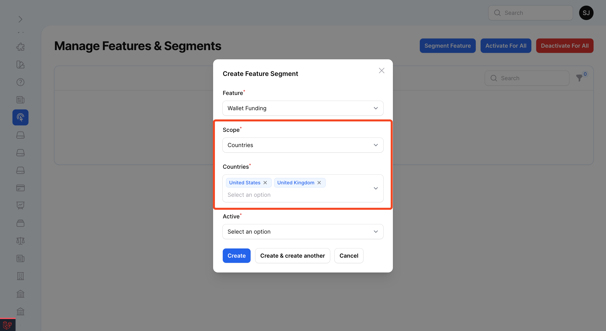
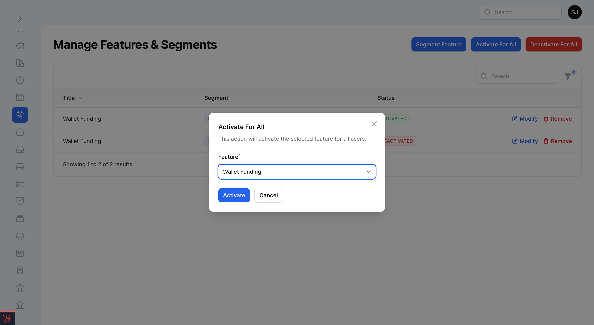
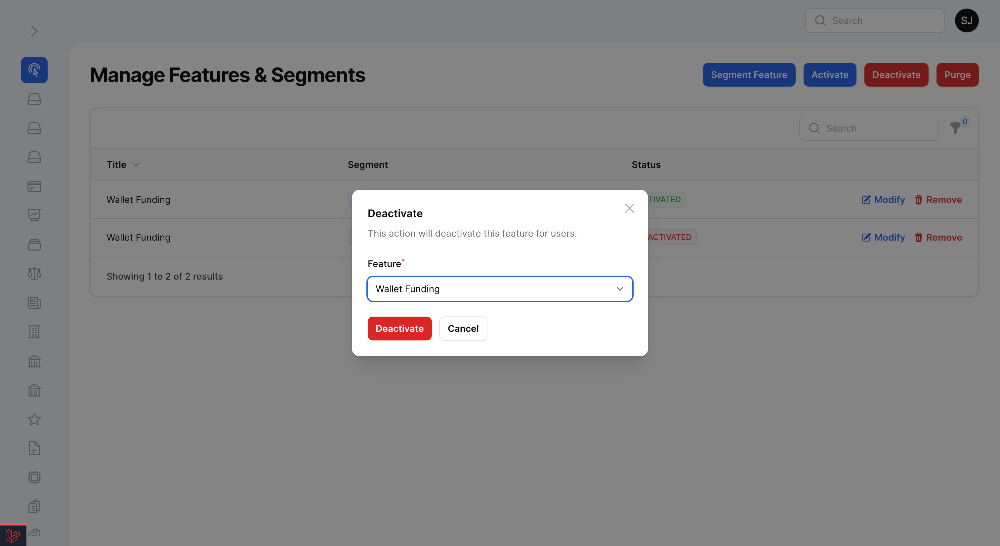

# Filament Feature Flags

[](https://packagist.org/packages/stephenjude/filament-feature-flags)
[](https://github.com/stephenjude/filament-feature-flags/actions?query=workflow%3Arun-tests+branch%3Amain)
[](https://github.com/stephenjude/filament-feature-flags/actions?query=workflow%3A"Fix+PHP+code+style+issues"+branch%3Amain)
[](https://packagist.org/packages/stephenjude/filament-feature-flags)

Filament implementation of feature flags and segmentation with Laravel Pennant.

- Apply features for a **segment** of users. Example by country or currency.
- Apply features for **individual** users. Example by email or ID.
- Apply features for **all** users.


## Installation

You can install the package via composer and publish and run the migrations with:

```bash
composer require stephenjude/filament-feature-flags

php artisan vendor:publish --provider="Laravel\Pennant\PennantServiceProvider"

php artisan vendor:publish --provider="Stephenjude\FilamentFeatureFlag\FeatureFlagPluginServiceProvider"

php artisan migrate
```

## Usage

You'll have to register the plugin in your panel provider.

```php
public function panel(Panel $panel): Panel
{
    return $panel
        ->plugin(
            Stephenjude\FilamentFeatureFlag\FeatureFlagPlugin::make()
        );
}
```

## Create Class Based Feature

To create a class based feature, you may invoke the pennant:feature Artisan command.

```bash
php artisan pennant:feature WalletFunding
```

When writing a feature class, you only need to use the `Stephenjude\FilamentFeatureFlag\Traits\WithFeatureResolve`
trait, which will be invoked to resolve the feature's initial value for a given scope.

```php
<?php

namespace App\Features;

use Stephenjude\FilamentFeatureFlag\Traits\WithFeatureResolver;

class WalletFunding
{
    use WithFeatureResolver;
}
```

## Feature Segmentation 
By default, this package resolves scope using the `App\Models\User` model and the default segment applies features for individual or group of users by email.



To add a new segment, add this code snippet below to the **segments** section on the `filament-feature-flag` config:

### Example 1: Adding Segment For Currency
```php
[
    'column' => 'currency',
    'source' => [
        'model' => \App\Models\Currency::class,
        'value' => 'code',
        'key' => 'code',
    ],
],
```


### Example 2: Adding Segment For Country
```php
[
    'column' => 'country',
    'source' => [
        'model' => \App\Models\Country::class,
        'value' => 'name',
        'key' => 'name',
    ],
],
```


## Events For Feature Activation And Deactivation

When a feature is activated or deactivate, this package dispatches events which your application can subscribe to. You
can listen to this events inside your EventServiceProvider class.

```php

use Stephenjude\FilamentFeatureFlag\Events\FeatureActivatedForAll;use Stephenjude\FilamentFeatureFlag\Events\FeatureDeactivatedForAll;use Stephenjude\FilamentFeatureFlag\Events\FeatureSegmentCreated;use Stephenjude\FilamentFeatureFlag\Events\FeatureSegmentModified;use Stephenjude\FilamentFeatureFlag\Events\FeatureSegmentRemoved;use Stephenjude\FilamentFeatureFlag\Events\RemovingFeatureSegment;

protected $listen = [
    FeatureActivatedForAll::class => [
        // Dispatched after feature is activated for all users.
    ],
    FeatureDeactivatedForAll::class => [
        // Dispatched after feature is deactivated for all users.
    ],
    FeatureSegmentCreated::class => [
        // Dispatched after feature segment is created.
    ],
    FeatureSegmentModified::class => [
        // Dispatched after feature segment is modified.
    ],
    RemovingFeatureSegment::class => [
        // Dispatched before feature segment is removed.
    ],
    FeatureSegmentRemoved::class => [
        // Dispatched after feature segment is removed.
    ],
];
```

You can publish the config file with:

```bash
php artisan vendor:publish --tag="filament-feature-flags-config"
```

This is the contents of the published config file:

```php
return [
    // This package supports only class based features.

    /*
    * This is the default state for all class based features and
     * state will be used if there is no segmentation.
    */
    'default' => true,

    /*
     * Default scope: User::class, Team::class
     */
    'scope' => App\Models\User::class,

    /*
     * Column names and data source that can be used to activate or deactivate for a segment of users.
     * This columns must exist on the users table and the data source must be a model.
     * COLUMN: The column name as defined on the default scope model config.
     * MODEL: The eloquent model of the source table.
     * VALUE: The column to be used as value.
     * KEY: The column to be used as key.
     */
    'segments' => [
        [
            'column' => 'email',
            'source' => [
                'model' => App\Models\User::class,
                'value' => 'email',
                'key' => 'email',
            ],
        ],
    ],

    'panel' => [
        /*
         * Navigation group for admin panel resource.
         */
        'group' => 'Settings',

        /*
         * Navigation item label for admin panel resource.
         */
        'label' => 'Manage Features',

        /*
         * Resource title for admin panel resource.
         */
        'title' => 'Manage Features & Segments',

        /*
         * Navigation item icon for admin panel resource.
         */
        'icon' => 'heroicon-o-cursor-arrow-ripple'
    ]
];
```

## Screenshots:





## Testing

```bash
composer test
```

## Changelog

Please see [CHANGELOG](CHANGELOG.md) for more information on what has changed recently.

## Contributing

Please see [CONTRIBUTING](CONTRIBUTING.md) for details.

## Security Vulnerabilities

Please review [our security policy](../../security/policy) on how to report security vulnerabilities.

## Credits

- [stephenjude](https://github.com/stephenjude)
- [All Contributors](../../contributors)

## License

The MIT License (MIT). Please see [License File](LICENSE.md) for more information.
